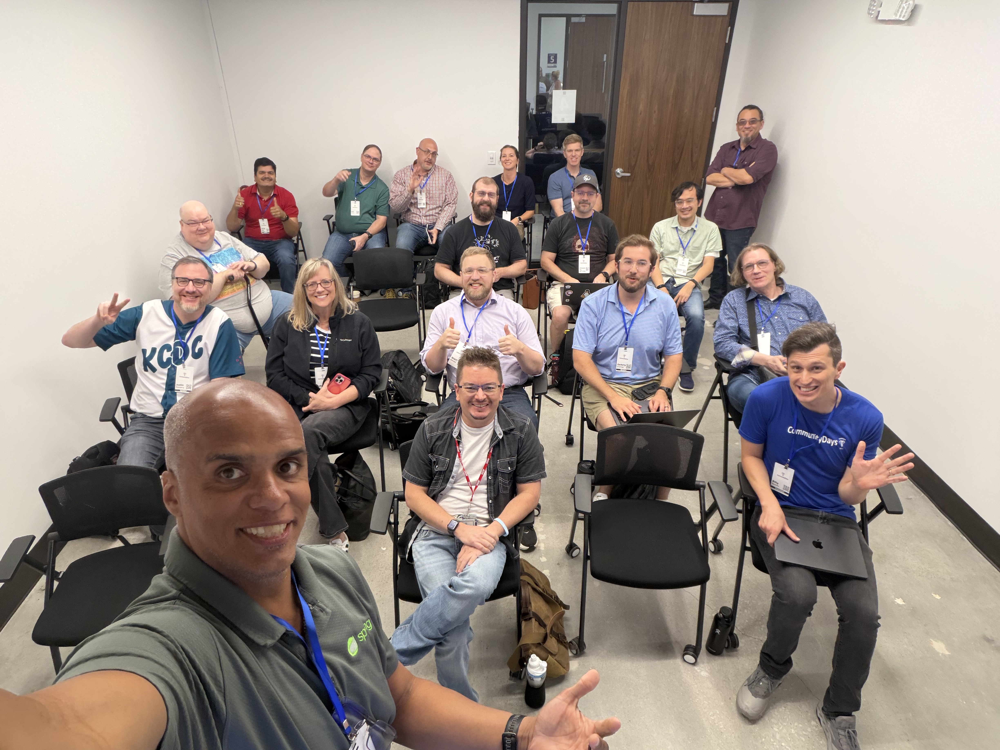

# Why My Children Will Never Deploy Active-Passive — Lightning

A lightning-talk (5–8 min) version of the original Philly ETE 2023 talk,
re-themed to match the Spring AI workshop deck. The live demo is a
multi-region, active-active Spring Boot app on VMware GemFire 10.1, fronted
by Spring Cloud Gateway. Five regions, one URL, no standby.

## Layout

```
docs/                    ← reveal.js slides (Spring AI theme)
demo/                    ← multi-module Maven build
├── pom.xml              ← parent (Boot 3.5, Cloud 2025.0, GemFire 10.1)
├── publish/             ← one container per region, writes to local GemFire
└── gateway/             ← Spring Cloud Gateway, lb://publish + retry
demo/docker/
├── region1..5/          ← each compose: GemFire cluster + its publishN app
├── gateway/             ← compose: the gateway (binds host :8080)
└── monitoring/          ← compose: Prometheus + Grafana + GemFire Console
```

## Host port map (no conflicts)

| Port  | Service                          | Where it comes from                  |
|-------|----------------------------------|--------------------------------------|
| 7999  | Lightning slides                 | `jwebserver` in `docs/`              |
| 8080  | Spring Cloud Gateway             | `demo/docker/gateway/`               |
| 7070  | GemFire Management Console       | `demo/docker/monitoring/`            |
| 9090  | Prometheus                       | `demo/docker/monitoring/`            |
| 3000  | Grafana                          | `demo/docker/monitoring/`            |

The five GemFire clusters **and** the five `publishN` apps run inside the
`gemfire-cache` Docker network and do **not** publish any host ports. Only
the gateway is reachable from the host.

## Run the slides

```bash
cd docs
jwebserver -p 8000
# open http://localhost:8000
```

Requires JDK 18+ (`jwebserver` ships with the JDK).

## Build the apps (one-time)

```bash
cd demo
./mvnw -DskipTests package spring-boot:build-image
# produces local images:  publish:0   gateway:0
```

## Run the demo

```bash
cd demo

# 1. Region 1 creates the gemfire-cache network. Each region brings up its
#    GemFire cluster AND its publishN app together.
docker compose -f docker/region1/compose.yaml     up -d
docker compose -f docker/region2/compose.yaml     up -d
docker compose -f docker/region3/compose.yaml     up -d
docker compose -f docker/region4/compose.yaml     up -d
docker compose -f docker/region5/compose.yaml     up -d

# 2. Monitoring + the gateway
docker compose -f docker/monitoring/compose.yaml  up -d
docker compose -f docker/gateway/compose.yaml     up -d
```

## Drive it

```bash
# Round-trip through the gateway. The response includes the region that handled it.
curl -s -X POST http://localhost:8080/publish | jq

# Tail gateway logs — you'll see one attempt + result per request.
docker logs -f gateway

# Kill a region. Within 5s, that region disappears from the gateway logs.
docker compose -f docker/region3/compose.yaml down

# Bring it back. After the gfN-config sidecar finishes, the gateway adds
# region3 back to rotation.
docker compose -f docker/region3/compose.yaml up -d
```

- Grafana → http://localhost:3000  (admin / admin)
- GemFire Management Console → http://localhost:7070
- Prometheus → http://localhost:9090
- Gateway actuator → http://localhost:8080/actuator/health
- Gateway routes (debug) → http://localhost:8080/actuator/gateway/routes

## Tear down

```bash
cd demo
docker compose -f docker/gateway/compose.yaml    down
docker compose -f docker/monitoring/compose.yaml down
for r in 5 4 3 2 1; do
  docker compose -f docker/region$r/compose.yaml down
done
```

## See Also 

- https://github.com/dashaun/my-children-will-never-deploy-active-passive
- https://github.com/dashaun-tanzu/multi-region-active-active-demo

## Thanks


