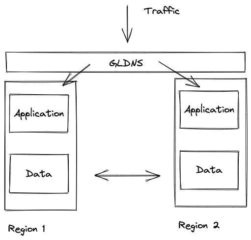

<!-- .slide: data-background-color="#6db33f" -->

# The New Way

## Active-Active, Multi-Region

---

## The Shift

- Convert **standby** infrastructure → **active** infrastructure
- Same spend. More capacity. Better reliability.
- Every region serves traffic. No drastic switch.

> Resilience > Robustness. Resilience → Reliability.

---

## What You Negotiate

| Concern | Question |
|---------|----------|
| Consistency | Eventually consistent? Stale reads OK? |
| Conflicts | Last-write-wins? CRDTs? App logic? |
| Data Transfer | WAN bandwidth, batch vs. stream |
| Latency | Where are your customers, really? |

Notes:
- Active-active is a data problem first, an infra problem second
- Get the data layer right — the rest is plumbing

---

## The Pattern

 <!-- .element: style="max-height: 420px;" -->

A data layer that replicates **everywhere**, with conflict resolution built in.
