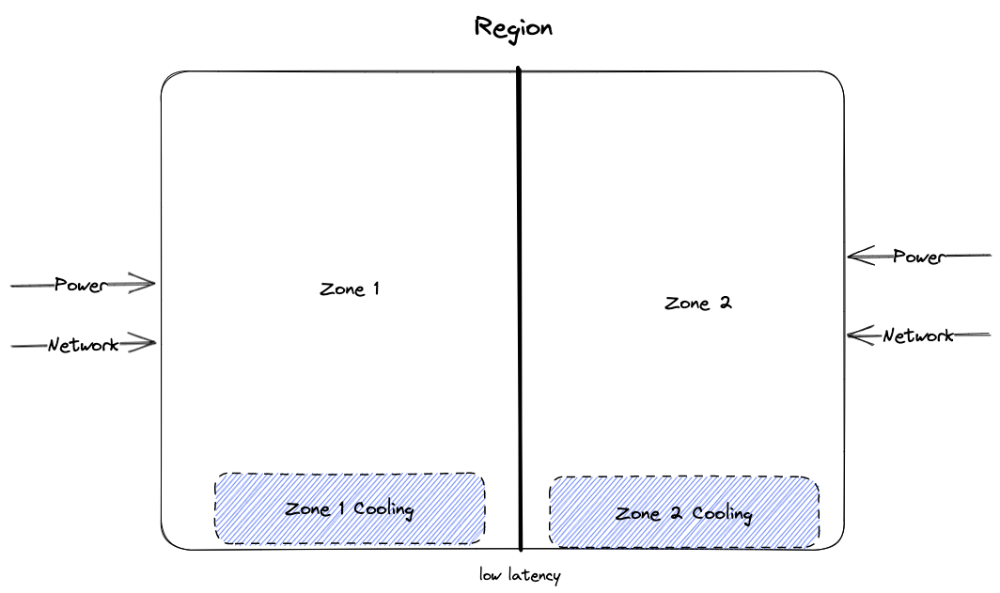
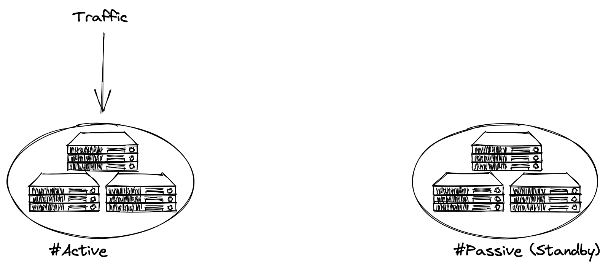
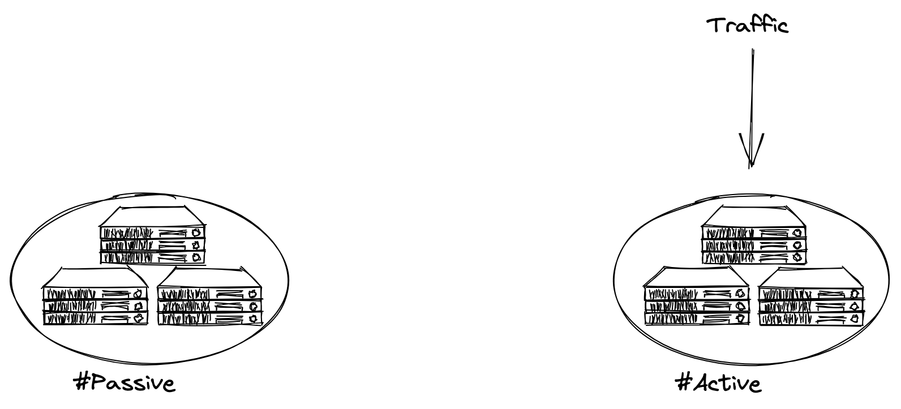

<!-- .slide: data-background-color="#191e1e" -->

# The Problem

## Active-Passive is a tax you pay every day

---

## Level Set

- **Zone** — one logical datacenter (power, network, cooling)
- **Region** — a set of nearby zones

 <!-- .element: style="max-height: 280px;" -->

---

## The Pattern You Inherited

 <!-- .element: style="max-height: 380px;" -->

One region takes traffic. The other waits.

---

## When It "Works"

 <!-- .element: style="max-height: 380px;" -->

A switch gets thrown. Customers retry. You hope.

---

## The Hidden Bill

- **Outages** lose money, trust, momentum, sleep
- Outages don't happen every day
- **Active-passive wastes money every day** <!-- .element: class="fragment" -->

Notes:
- Standby infra costs the same as active infra — it just doesn't earn anything
- Raise your hand if you like paying for infrastructure that isn't being used

---

> Latency is the new downtime.

Notes:
- A 2-region active-passive doesn't help your customers in region 3
- Failover takes minutes — your SLA dies in seconds
